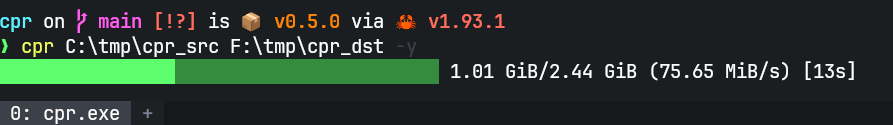

# cpr

A fast file and directory copy tool with glob pattern filtering and parallel copying. Built because PowerShell's `Copy-Item` doesn't have one.

- **Glob pattern filtering** — `-e node_modules,.git,*.log` or `-i *.rs` instead of robocopy's `/XD node_modules /XF *.log`
- **Parallel by default** — copies files concurrently using all available cores
- **Progress bar** — real-time progress with bytes, throughput, and elapsed time (auto-hides when piped)
- **Human-readable output** — `Copied 2.44 GiB in 32 seconds (75.65 MiB/s) [70 files]`
- **Minimal overhead** — no ACLs, no retries, no attribute preservation, just copies bytes



## Installation

### Scoop (Windows)

```powershell
scoop bucket add cpr https://github.com/canmanalp/scoop-cpr
scoop install cpr
```

### Cargo

```bash
cargo install --git https://github.com/canmanalp/cpr
```

### Download binary

Grab the latest `cpr.exe` from [GitHub Releases](https://github.com/canmanalp/cpr/releases) and place it somewhere in your PATH.

### Build from source

```bash
git clone https://github.com/canmanalp/cpr
cd cpr
cargo build --release
# binary is at target/release/cpr.exe
```

## Usage

```
cpr <SOURCE> <DESTINATION> [OPTIONS]
```

```powershell
# Copy a file
cpr report.pdf D:\backup\

# Copy a directory (prompts for confirmation)
cpr C:\project\ D:\backup\project\

# Exclude patterns — skip files and folders that match
cpr C:\project\ D:\backup\project\ -e node_modules,.git,target -y

# Include patterns — copy only files that match
cpr C:\project\ D:\backup\project\ -i *.rs,*.toml

# Copy only a specific folder
cpr C:\project\ D:\backup\project\ -i src/**

# Combine include and exclude
cpr C:\project\ D:\backup\project\ -i *.rs,*.toml -e tests/**

# Preview what would be copied (no files are written)
cpr C:\project\ D:\backup\project\ -e node_modules -n
```

### Options

| Flag | Description |
|---|---|
| `-e, --exclude <PATTERNS>` | Patterns to exclude (files and directories) |
| `-i, --include <PATTERNS>` | Patterns to include (only matching files are copied) |
| `-y, --yes` | Skip confirmation prompt for directory copies |
| `-n, --dry-run` | Preview what would be copied without copying |

Patterns can be comma-separated (`-e *.log,*.tmp`) or passed as multiple flags (`-e *.log -e *.tmp`).

### Glob patterns

| Pattern | What it does |
|---|---|
| `node_modules` | Matches exact name |
| `*.log` | Matches files by extension |
| `*.rs,*.toml` | Matches multiple extensions |
| `**/*.test.js` | Matches in any subdirectory |
| `src/**` | Matches everything inside `src` |

### How include and exclude interact

- **Exclude** applies to both files and directories — excluded directories are skipped entirely
- **Include** only filters files — directories are always walked so matching files inside them can be found
- When both are used, exclude is checked first

## License

MIT
